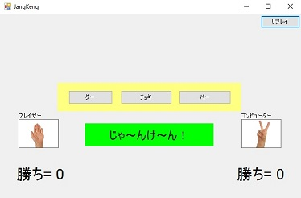

# SagiJanken
詐欺機能を搭載した、シンプルなジャンケンゲームです。  
　

コンピューターと対戦し、先に５回勝てば勝利です。  
  

でも、プレイヤーは絶対に勝てない様に作られています。  
　・最初は普通。  
　・プレイヤーがじわじわ勝つ様になっている。  
　・プレイヤーがリーチになると、コンピューターが追い上げてくる。  
　・両者リーチになると、白熱展開っぽくなる。  
　・最後はプレイヤーが絶対負ける。  

楽しんでください。  

# 環境
Visual C++ 2008

(2016/9)
