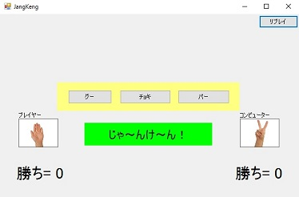
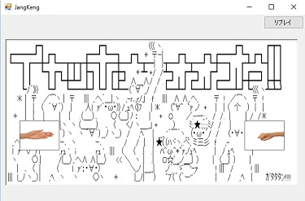

# SagiJanken

> ## 🎮 ブラウザ版（HTML5リメイク）
> Visual C++ 2008 製の原作を、**プラグイン・ビルド不要でブラウザ上で動く HTML5 / JavaScript** に移植しました。
> AA画像・実写の手・詐欺ロジック（ノーマル／詐欺／負けモード、最終決戦のあいこ連発）まで原作準拠です。
>
> - **遊ぶ:** <https://tobisako.github.io/SagiJanken/>（紹介ページ index.html / ゲーム本体 game.html）
> - **遊び方:** スタート → グー・チョキ・パー（キー1・2・3でも可）。先に5回勝てば勝利です。がんばって。
> - 隠し要素も原作どおり移植しています（ヒントはゲーム内で）
> - 効果音はリメイクでの追加です（[MOSS-SoundEffect-v2.0](https://huggingface.co/OpenMOSS-Team/MOSS-SoundEffect-v2.0) で生成・🔊ボタンでON/OFF可）
> - ※原作は定数の都合で実質6勝勝負でしたが（ソースコメント曰く「勝利数は『6』…5にすればよかった」）、ブラウザ版はコメントどおり5勝勝負に修正しています

詐欺機能を搭載した、シンプルなジャンケンゲームです。  
　

コンピューターと対戦し、先に５回勝てば勝利です。  
  

でも、プレイヤーは絶対に勝てない様に作られています。  
　・最初は普通。  
　・プレイヤーがじわじわ勝つ様になっている。  
　・プレイヤーがリーチになると、コンピューターが追い上げてくる。  
　・両者リーチになると、白熱展開っぽくなる。  
　・最後はプレイヤーが絶対負ける。  

楽しんでください。  

# 環境
Visual C++ 2008

(2016/9)
